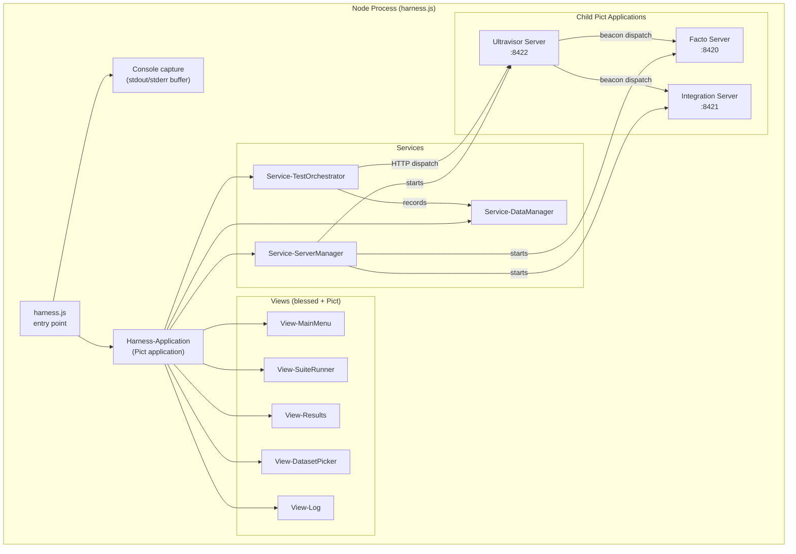
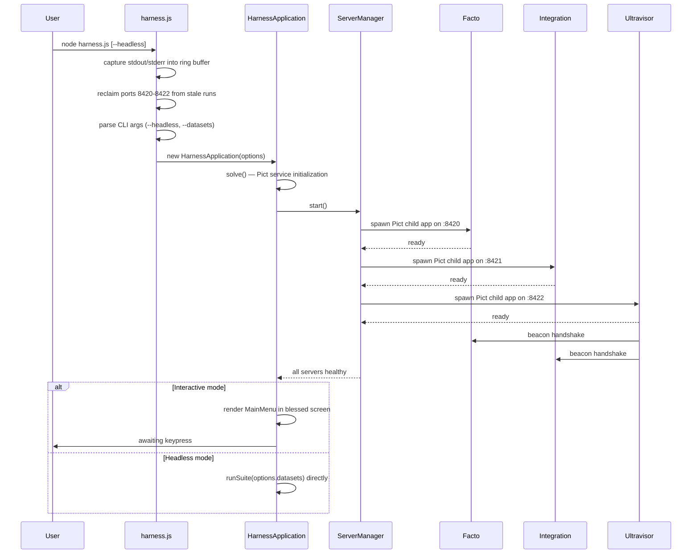
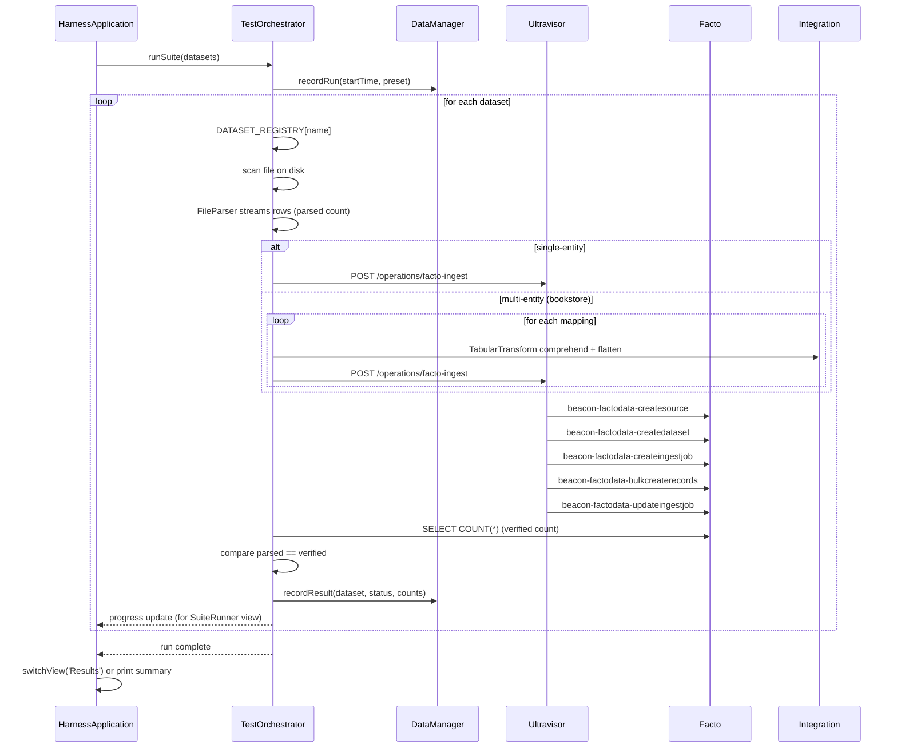

# Architecture

The harness is a single Node process that hosts three in-process Retold servers, a blessed + Pict terminal UI, and a test orchestrator. Every component is wired through Pict's service container so the same orchestrator can drive either the interactive TUI or the headless runner.

## Process Layout



## Three-Server Stack

All three servers are child Pict applications running in the same Node process on loopback. They communicate over HTTP so that the beacon dispatch path is identical to a distributed deployment.

| Server | Port | Module | Role |
|---|---|---|---|
| **Facto** | `8420` | `retold-facto` + `orator` + `orator-serviceserver-restify` | Data warehouse. Owns Sources, Datasets, IngestJobs, Records, Projections. SQLite file `./data/facto.db`. |
| **Integration** | `8421` | `meadow-integration` + `orator` | File parsing (`FileParser`) and tabular transform (`TabularTransform`). SQLite workspace `./data/target.db`. |
| **Ultravisor** | `8422` | `ultravisor` + `orator` + `ultravisor-beacon` | Workflow execution engine. Reads operation JSON from `operations/`, dispatches task sequences to registered beacons. |

Each server registers with Ultravisor as a beacon on startup, exposing a set of named capabilities (e.g. `beacon-factodata-createsource`). Ultravisor then dispatches workflow steps by name, and the matching beacon handles them over HTTP.

## Class Hierarchy

```mermaid
classDiagram
	class PictApplicationClass {
		+pict
		+services
		+views
		+solve()
		+render()
	}

	class HarnessApplication {
		+uiState
		+currentPreset
		+selectedDatasets
		+runSuite(options)
		+cleanAndExecute()
		+switchView(name)
	}

	class ServerManager {
		+servers : { facto, integration, ultravisor }
		+start()
		+stop()
		+isHealthy()
	}

	class TestOrchestrator {
		+DATASET_REGISTRY
		+runDataset(name)
		+runSuite(names)
		+parseFile(file, format)
		+dispatchIngest(operation, payload)
		+verifyCount(datasetHash)
	}

	class DataManager {
		+DATA_DIR_PATH
		+cleanDataDirectory()
		+initializeHarnessDb()
		+recordRun(run)
		+recordResult(result)
	}

	class HarnessView {
		+viewName
		+render()
		+handleKey(key)
	}

	PictApplicationClass <|-- HarnessApplication
	HarnessApplication --> ServerManager
	HarnessApplication --> TestOrchestrator
	HarnessApplication --> DataManager
	HarnessApplication --> HarnessView
```

## Startup Sequence



## Run-Suite Flow



## File Layout

```
ultravisor-suite-harness/
├── harness.js                          # Entry point: capture, cleanup, bootstrap
├── package.json
├── README.md
├── source/
│   ├── Harness-Application.js          # Pict application, navigation, presets
│   ├── services/
│   │   ├── Service-ServerManager.js    # Three-server lifecycle
│   │   ├── Service-TestOrchestrator.js # DATASET_REGISTRY + per-dataset pipeline
│   │   └── Service-DataManager.js      # ./data and harness.db management
│   └── views/
│       ├── View-MainMenu.js            # Main menu with status
│       ├── View-SuiteRunner.js         # Live progress while running
│       ├── View-Results.js             # Pass/fail summary table
│       ├── View-DatasetPicker.js       # Preset + dataset selection
│       └── View-Log.js                 # Captured server output
├── operations/
│   ├── facto-ingest.json               # Five-step ingest workflow
│   ├── facto-full-ingest.json
│   ├── facto-projection-import.json
│   └── facto-projection-deploy.json
├── fixtures/
│   ├── books.csv                       # 130k+ row multi-entity source
│   ├── books-variant.csv
│   └── bookstore/
│       ├── mapping_books_book.json
│       ├── mapping_books_author.json
│       └── mapping_books_BookAuthorJoin.json
├── test/
│   └── validate-harness.js             # External headless runner
├── docs/
│   ├── README.md
│   ├── _cover.md, _sidebar.md, _topbar.md
│   ├── purpose.md
│   ├── usage.md
│   ├── architecture.md
│   ├── pipeline.md
│   ├── datasets.md
│   └── tui-reference.md
└── data/                               # runtime, git-ignored
```

## Console Capture

Before blessed takes ownership of the terminal, `harness.js` monkey-patches `process.stdout.write` and `process.stderr.write` to also append to an in-memory ring buffer (2000 lines). This buffer powers `View-Log`, which is the only place server stdout is visible in interactive mode -- blessed would otherwise hide it behind its own rendering.

In headless mode the capture is still installed, but stdout/stderr also flush to the real TTY so CI logs remain intact.

## Port Reclaim & Graceful Shutdown

Early in `harness.js`, before any Pict code runs, the harness probes ports `8420-8422` and kills any listeners that look like orphaned harness servers. This makes repeated crash-and-retry cycles painless.

A `SIGINT` handler tears down all three servers, clears the blessed screen, and prints a final status line so Ctrl+C never leaves stale processes behind. A 30-second safety timer forces an exit if shutdown hangs.

## Persistent Results

`Service-DataManager` opens `./data/harness.db` (Meadow over SQLite) and ensures two tables exist:

| Table | Columns (abridged) |
|---|---|
| `HarnessTestRun` | `IDHarnessTestRun`, `Preset`, `StartedAt`, `CompletedAt`, `PassCount`, `FailCount` |
| `HarnessTestResult` | `IDHarnessTestResult`, `IDHarnessTestRun`, `Dataset`, `Status`, `Parsed`, `Loaded`, `Verified`, `Error`, `CreatedAt` |

`View-Results` renders the most recent run's rows from `HarnessTestResult`. Historical rows remain until the next Clean & Execute wipes the file.
