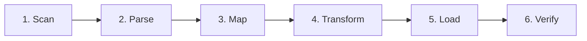
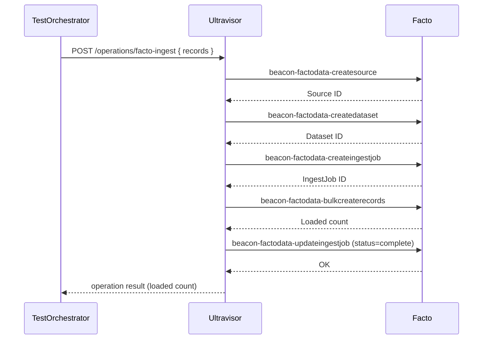

# Pipeline

For each dataset the harness runs a six-stage pipeline. A dataset passes only when every stage completes and the final row count matches the parser's emitted count.

## The Six Stages



| Stage | Owner | What Happens |
|---|---|---|
| **1. Scan** | `Service-TestOrchestrator` | Look up the dataset in `DATASET_REGISTRY`, resolve its file path, confirm the file exists. |
| **2. Parse** | `meadow-integration FileParser` | Auto-detect the format (CSV, TSV, JSON, fixed-width), stream the file, emit row objects. |
| **3. Map** | `meadow-integration` mappings | Apply an identity mapping (default) or one or more JSON mapping descriptors to derive entities. |
| **4. Transform** | `meadow-integration TabularTransform` | Flatten nested objects and sanitize values into a shape Facto will accept. |
| **5. Load** | `ultravisor` -> `retold-facto` beacons | Dispatch the `facto-ingest` operation; Ultravisor walks the five-step beacon sequence against Facto. |
| **6. Verify** | `Service-TestOrchestrator` | `SELECT COUNT(*)` on the resulting Facto dataset and compare to the parser's count. |

## Stage 1: Scan

`DATASET_REGISTRY` in `source/services/Service-TestOrchestrator.js` defines where every dataset lives:

```javascript
'datahub-country-codes':
{
	files: ['data/country-codes.csv'],
	format: 'csv'
},
'bookstore':
{
	files: ['books.csv'],
	format: 'csv',
	fixtureSource: true,             // load from local ./fixtures/ instead of facto-library
	mappings:
	[
		{ file: 'bookstore/mapping_books_book.json',           entity: 'Book' },
		{ file: 'bookstore/mapping_books_author.json',         entity: 'Author' },
		{ file: 'bookstore/mapping_books_BookAuthorJoin.json', entity: 'BookAuthorJoin' }
	]
}
```

Non-fixture datasets resolve to `./modules/dist/facto-library/<name>/<file>`. Fixture datasets resolve to `./fixtures/<file>`. A missing file is reported as an immediate failure with a clear error so you can decide whether to fetch the dataset or skip it.

## Stage 2: Parse

The harness asks `meadow-integration`'s `FileParser` to stream the file. CSV is the common case, but JSON, TSV, and fixed-width are all handled by the same entry point.

Parser output is a sequence of flat row objects: `{ column: value, column: value, ... }`. The harness counts these as the **parsed count** and holds them in memory for the mapping and transform stages. For very large files the parser streams in chunks; there is no single in-memory array of every row.

Failures at this stage usually indicate:

- A BOM, encoding, or newline issue on the input file
- A column name collision (`meadow-integration` enforces unique column headers)
- A file-format regression in `meadow-integration` itself

## Stage 3: Map

The default mapping is **identity**: every parsed column becomes a record field with the same name, and a GUID is generated for each row. This is what every single-entity dataset uses.

Multi-entity datasets (currently only `bookstore`) supply one or more JSON mapping descriptors:

```json
{
	"Entity": "Book",
	"GUIDTemplate": "Book_{id}",
	"Mappings":
	{
		"Title": "{title}",
		"PublicationYear": "round(original_publication_year)",
		"ISBN": "{isbn}",
		"Language": "{language_code}",
		"Genre": "Unknown",
		"ImageURL": "{image_url}"
	}
}
```

Each mapping descriptor describes one output entity. The harness parses the input file once, then applies each mapping separately to produce a distinct record stream per entity. Mapping expressions may reference parsed columns (`{title}`), literals (`"Unknown"`), or invoke comprehension helpers (`round(original_publication_year)`).

## Stage 4: Transform

`TabularTransform` is the last meadow-integration stage before records leave the process. It:

- **Flattens** nested objects into dot-paths (`Address.City`, `Address.State`) so the warehouse sees a flat record
- **Sanitizes** values: numeric columns coerced to numbers, empty strings coerced to `null`, extreme values clamped
- **Validates** GUID templates against actual row data to catch broken substitutions early

Its output is the **transformed count** -- usually equal to the parsed count, except when mapping expressions filter rows or when multi-entity expansion produces a different cardinality.

## Stage 5: Load

The load stage is where the harness actually exercises Ultravisor workflow dispatch. The orchestrator sends an HTTP POST to Ultravisor (`http://localhost:8422/operations/facto-ingest`) with the transformed records as the payload. Ultravisor reads `operations/facto-ingest.json` and dispatches a five-step sequence of beacon calls against Facto:



The **loaded count** is what Facto reports back from the bulk-create step. A dataset where loaded < parsed has hit a beacon-side failure -- usually a schema mismatch or a record that Facto's validation rejected.

For multi-entity datasets the orchestrator runs one full Load sequence per mapping, producing a separate Source + Dataset + IngestJob triple in Facto for each entity.

## Stage 6: Verify

After the load completes, the orchestrator issues a direct `SELECT COUNT(*)` against the resulting Facto dataset's record table. The **verified count** is compared to the parsed count:

- `parsed == loaded == verified` -> **PASS**
- any mismatch -> **FAIL**, with the offending counts included in the result row

Verification is deliberately independent of the load-stage's self-reported count because that catches a class of failures where the beacon returns success but the rows are not actually queryable (e.g. a silent transaction rollback, a connector bug).

## Example: Bookstore Multi-Entity Run

The Bookstore fixture is the one dataset that exercises every moving part of the pipeline, so it's worth walking through:

1. **Scan** -- resolve `./fixtures/books.csv` (marked as `fixtureSource: true`).
2. **Parse** -- FileParser streams the 130k+ row CSV once.
3. **Map × 3** -- orchestrator loads `mapping_books_book.json`, `mapping_books_author.json`, and `mapping_books_BookAuthorJoin.json` and applies each to the parsed stream, producing three separate record streams.
4. **Transform × 3** -- TabularTransform flattens each stream independently.
5. **Load × 3** -- Ultravisor dispatches `facto-ingest` three times, producing three Facto datasets (`Book`, `Author`, `BookAuthorJoin`).
6. **Verify × 3** -- three `SELECT COUNT(*)` queries confirm each dataset landed.

The overall `bookstore` row in the results table passes only when all three sub-runs pass.

## Failure Isolation

When a dataset fails, the results row tells you exactly which stage broke:

| Symptom | Likely Stage |
|---|---|
| "file not found" | 1. Scan |
| "parsed count = 0" or parser exception | 2. Parse |
| "mapping expression failed" or GUID template error | 3. Map |
| "flatten/sanitize error" | 4. Transform |
| Ultravisor operation rejected or beacon exception | 5. Load |
| `loaded != verified` | 5. Load or 6. Verify (connector bug) |
| `parsed != verified` with `parsed == loaded` | 6. Verify (transaction or persistence bug) |

For deeper inspection, switch to `View-Log` (`5`) in the TUI or open `./data/harness.db` directly to see the per-dataset error column.
